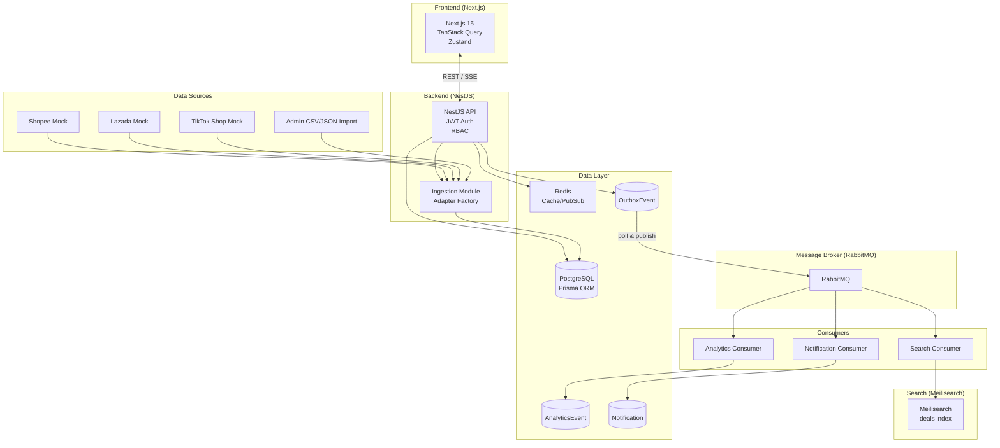

# DealXin — Real-time Deal Aggregator Platform

[](https://github.com/JunnDung/DealXin/actions/workflows/ci.yml)
[](https://github.com/JunnDung/DealXin/actions/workflows/playwright.yml)

> Một nền tảng full-stack để tổng hợp deal, voucher, flash sale và ưu đãi thương mại điện tử Việt Nam.

## Live Demo

- **Frontend**: https://dealxin.vercel.app
- **Backend API**: https://dealxin-api.up.railway.app/api
- **Swagger Docs**: https://dealxin-api.up.railway.app/api/docs

## Quick Start

```bash
# Clone repo
git clone https://github.com/JunnDung/DealXin.git
cd dealxin

# Install dependencies (requires pnpm >= 9.0.0)
pnpm install

# Start infrastructure
docker compose up -d

# Copy env file and fill in secrets
cp .env.example .env

# Run database migrations and seed
pnpm --filter api db:migrate:dev
pnpm --filter api db:seed

# Start development (API on :3001, Web on :3000)
pnpm dev
```

| Service   | URL                          |
| --------- | ---------------------------- |
| Frontend  | http://localhost:3000        |
| API       | http://localhost:3001         |
| Swagger   | http://localhost:3001/api/docs |
| RabbitMQ  | http://localhost:15672        |
| Meilisearch| http://localhost:7700       |

## Tech Stack

| Layer           | Technology                                |
| --------------- | ----------------------------------------- |
| Frontend        | Next.js 15, React 18, TypeScript strict  |
| Styling         | Tailwind CSS, shadcn/ui                   |
| State/Fetch    | TanStack Query, Zustand                   |
| Backend         | NestJS 10, TypeScript strict             |
| ORM             | Prisma 6, PostgreSQL 17                  |
| Cache           | Redis 7                                  |
| Message Broker  | RabbitMQ 3                               |
| Search          | Meilisearch                              |
| Container       | Docker Compose                           |
| CI/CD           | GitHub Actions (lint, typecheck, test, build, E2E) |
| Deploy          | Vercel (frontend), Railway (backend)    |

## Architecture



### Design Patterns Implemented

| Pattern             | Where                              | Purpose                      |
| ------------------ | ---------------------------------- | ---------------------------- |
| Outbox Pattern      | `OutboxEvent` table               | Reliable event publishing     |
| Adapter Pattern     | `IngestionModule`                  | Multi-platform data ingestion |
| CQRS-lite           | Event consumers                    | Async read-model updates     |
| Repository Pattern  | `PrismaDealRepository`             | Data access abstraction       |
| Strategy Pattern     | `DealStatusTransitionStrategy`      | State machine validation     |

## Project Phases

All 12 phases completed:

| Phase | Description                       | Status |
| ----- | --------------------------------- | ------ |
| 0     | Audit & Planning                  | ✓ Done |
| 1     | Monorepo Scaffold                 | ✓ Done |
| 2     | Database & Auth                  | ✓ Done |
| 3     | Deals Core                       | ✓ Done |
| 4     | UI Polish & UX                   | ✓ Done |
| 5     | Ingestion & Adapters             | ✓ Done |
| 6     | Event-Driven & Microservices     | ✓ Done |
| 7     | Search (Meilisearch)             | ✓ Done |
| 8     | Notifications                    | ✓ Done |
| 9     | Analytics                        | ✓ Done |
| 10    | Observability & CI               | ✓ Done |
| 11    | Deployment                       | ✓ Done |
| 12    | Recruiter Polish                 | ✓ Done |

## Features

### User Features
- Browse and search deals from Shopee, Lazada, TikTok Shop
- Filter by platform, category, discount range
- Sort by newest, hot score, discount percentage
- Bookmark deals, vote (upvote/downvote)
- Real-time notification on deal approval
- Responsive mobile layout

### Admin Features
- Moderation dashboard (approve/reject/expire pending deals)
- Analytics: views, upvotes, bookmarks, daily submissions
- Deal source management
- Import via CSV/JSON or mock platform crawlers
- Audit logs for all admin actions

### Architecture Highlights
- **Event-driven**: Outbox pattern guarantees at-least-once delivery via RabbitMQ
- **CQRS-lite**: Write via REST, async read-model updates via consumers
- **Search**: Meilisearch auto-indexes approved deals within 2s
- **Type-safe monorepo**: Shared contracts between API and Web

## Test Accounts

| Role  | Email                    | Password   |
| ----- | ------------------------ | ---------- |
| Admin | admin@dealxin.local      | Admin1234! |
| User  | demo@dealxin.local       | Test1234!  |

## Documentation

| Document                              | Description                                      |
| ------------------------------------- | ------------------------------------------------ |
| [Roadmap](docs/roadmap.md)            | Phase-by-phase progress tracker                  |
| [Architecture](docs/architecture.md)   | System architecture, data flows, module map      |
| [Design Patterns](docs/design-patterns.md) | Repository, Strategy, Adapter, Outbox, CQRS patterns |
| [Event Contracts](docs/event-contracts.md) | Domain event shapes, queue architecture      |
| [Database ERD](docs/database-erd.md)   | Full schema visualization                        |
| [API Docs](docs/api-docs.md)          | Endpoint reference                              |
| [Testing Guide](docs/testing.md)       | Unit, integration, and E2E testing              |
| [Deployment Guide](docs/deployment.md) | Vercel, Railway, Docker                        |
| [CV Bullets](docs/cv-bullets.md)      | Technical accomplishments for resume              |
| [Interview Q&A](docs/interview-qa.md) | Common interview questions and answers           |
| [Docs Index](docs/index.md)            | All documentation links                         |

## Environment Variables

See [.env.example](.env.example).

Key groups:
- **Database**: `DATABASE_URL`
- **Auth**: `JWT_SECRET`, `JWT_REFRESH_SECRET`, `JWT_ACCESS_EXPIRY`, `JWT_REFRESH_EXPIRY`
- **Infrastructure**: `REDIS_URL`, `RABBITMQ_URL`
- **Search**: `MEILISEARCH_HOST`, `MEILISEARCH_API_KEY`
- **CORS**: `CORS_ORIGIN`

## Scripts

```bash
pnpm dev           # Start all services (API + Web)
pnpm build         # Build all packages
pnpm lint          # Lint all packages
pnpm typecheck     # TypeScript check all packages
pnpm test          # Unit tests (API + Web)
pnpm test:e2e     # Playwright E2E tests
pnpm db:migrate:dev  # Run migrations (dev)
pnpm db:seed       # Seed database
pnpm docker:up    # Start Docker services
pnpm docker:down  # Stop Docker services
```

## Deployment

### Frontend (Vercel)

```bash
cd apps/web && vercel --prod
```

Required environment variable:
- `NEXT_PUBLIC_API_URL` — Backend API URL (e.g., `https://dealxin-api.up.railway.app/api`)

### Backend (Railway / Render / Fly.io)

```bash
cd apps/api
pnpm build && node dist/main.js
```

Required environment variables: `DATABASE_URL`, `JWT_SECRET`, `JWT_REFRESH_SECRET`, `REDIS_URL`, `RABBITMQ_URL`, `MEILISEARCH_HOST`, `MEILISEARCH_API_KEY`, `CORS_ORIGIN`, `PORT`.

## License

MIT
