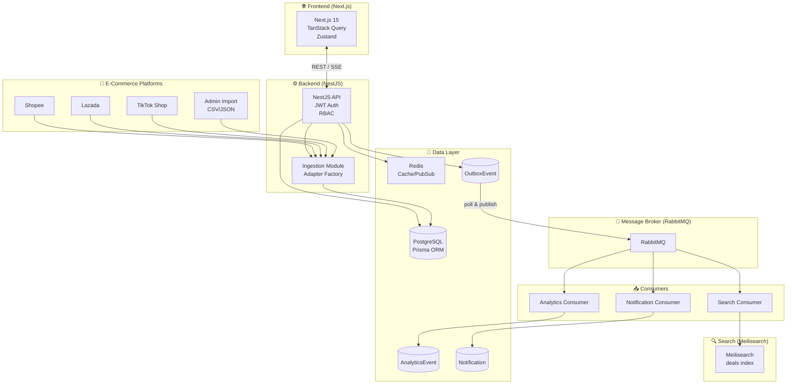

# DealXin — Real-time Deal Aggregator Platform

[](https://github.com/JunnDung/DealXin/actions/workflows/ci.yml)

> Một nền tảng full-stack để tổng hợp deal, voucher, flash sale và ưu đãi thương mại điện tử Việt Nam.

## Project Status

| Phase    | Mô tả                        | Trạng thái |
| -------- | ---------------------------- | ---------- |
| Phase 0  | Audit & Planning             | ✓ Done     |
| Phase 1  | Monorepo Scaffold            | ✓ Done     |
| Phase 2  | Database & Auth              | ✓ Done     |
| Phase 3  | Deals Core                   | ✓ Done     |
| Phase 4  | UI Polish & UX               | ✓ Done     |
| Phase 5  | Ingestion & Adapters         | ✓ Done     |
| Phase 6  | Event-Driven & Microservices | ✓ Done     |
| Phase 7  | Search (Meilisearch)         | ✓ Done     |
| Phase 8  | Notifications                | ✓ Done     |
| Phase 9  | Analytics                    | ✓ Done     |
| Phase 10 | Observability & CI           | ✓ Done     |
| Phase 11 | Deployment                   | ✓ Done     |

Đang xây dựng theo từng phase. Xem [docs/roadmap.md](docs/roadmap.md) để biết tiến độ.

## Quick Start

```bash
# Clone repo
git clone https://github.com/JunnDung/DealXin.git
cd dealxin

# Install dependencies (requires pnpm >= 9.0.0)
pnpm install

# Start infrastructure
docker compose up -d

# Copy env file
cp .env.example .env
# Edit .env and fill in secrets

# Start development
pnpm dev
```

Frontend: http://localhost:3000
API: http://localhost:3001
Swagger: http://localhost:3001/api

## Tech Stack

| Layer          | Technology                              |
| -------------- | --------------------------------------- |
| Frontend       | Next.js 15, React 18, TypeScript strict |
| Styling        | Tailwind CSS, shadcn/ui                 |
| State          | TanStack Query, Zustand                 |
| Backend        | NestJS 10, TypeScript strict            |
| ORM            | Prisma 6, PostgreSQL 17                 |
| Cache          | Redis 7                                 |
| Message Broker | RabbitMQ 3                              |
| Search         | Meilisearch                             |
| Container      | Docker Compose                          |
| CI/CD          | GitHub Actions                          |
| Deploy         | Vercel (frontend), Railway (backend)    |

## Architecture



### Key Patterns Implemented

| Pattern            | Where                          | Purpose                       |
| ------------------ | ------------------------------ | ----------------------------- |
| Outbox Pattern     | `OutboxEvent` table            | Reliable event publishing     |
| Adapter Pattern    | `IngestionModule`              | Multi-platform data ingestion |
| CQRS-lite          | Event consumers                | Async read-model updates      |
| Repository Pattern | `PrismaDealRepository`         | Data access abstraction       |
| Strategy Pattern   | `DealStatusTransitionStrategy` | State machine validation      |

## Live Demo

> 🚀 **Coming Soon**: The frontend will be deployed to Vercel and the backend to Railway.

- **Frontend**: https://dealxin.vercel.app
- **Backend API**: https://dealxin-api.up.railway.app/api

_To run locally, see [Deployment Guide](./docs/deployment.md)_

## Phases

| Phase | Mô tả                        | Trạng thái |
| ----- | ---------------------------- | ---------- |
| 0     | Audit & Planning             | ✓ Done     |
| 1     | Monorepo Scaffold            | ✓ Done     |
| 2     | Database & Auth              | ✓ Done     |
| 3     | Deals Core                   | ✓ Done     |
| 4     | UI Polish & UX               | ✓ Done     |
| 5     | Ingestion & Adapters         | ✓ Done     |
| 6     | Event-Driven & Microservices | ✓ Done     |
| 7     | Search (Meilisearch)         | ✓ Done     |
| 8     | Notifications                | ✓ Done     |
| 9     | Analytics                    | ✓ Done     |
| 10    | Observability & CI           | ✓ Done     |
| 11    | Deployment                   | ✓ Done     |
| 12    | Recruiter Polish             | Pending    |

## Docs

- [Roadmap](docs/roadmap.md)
- [Architecture Overview](docs/architecture.md) — System architecture, data flows, module map
- [Design Patterns](docs/design-patterns.md) — Repository, Strategy, Adapter, Outbox, CQRS patterns with code references
- [Event Contracts](docs/event-contracts.md) — Domain event shapes, queue architecture, consumer idempotency
- [Database ERD](docs/database-erd.md)
- [API Docs](docs/api-docs.md)
- [Testing Guide](docs/testing.md)
- [Deployment Guide](docs/deployment.md)
- [CV Bullets](docs/cv-bullets.md)
- [Interview Q&A](docs/interview-qa.md)

## Environment Variables

Xem [.env.example](.env.example).

## Deployment

### Frontend (Vercel)

```bash
cd apps/web
vercel --prod
```

Required environment variables:

- `NEXT_PUBLIC_API_URL` — URL of the API server (e.g., `https://dealxin-api.vercel.app/api`)

### Backend (Railway / Render / Fly.io)

The API is a standard NestJS application:

```bash
cd apps/api
# Build
pnpm build
# Start
node dist/main.js
```

Required environment variables:

- `DATABASE_URL` — PostgreSQL connection string
- `JWT_SECRET` — JWT signing secret
- `JWT_REFRESH_SECRET` — JWT refresh signing secret
- `JWT_ACCESS_EXPIRY` — JWT access token expiration (default: 15m)
- `JWT_REFRESH_EXPIRY` — JWT refresh token expiration (default: 7d)
- `REDIS_URL` — Redis connection string
- `RABBITMQ_URL` — RabbitMQ connection string
- `MEILISEARCH_HOST` — Meilisearch host
- `MEILISEARCH_API_KEY` — Meilisearch API key
- `CORS_ORIGIN` — Allowed CORS origins
- `PORT` — Server port (default: 3001)

### Database Migrations

Run migrations on deploy:

```bash
cd apps/api
pnpm prisma migrate deploy
pnpm prisma generate
```

## License

MIT
